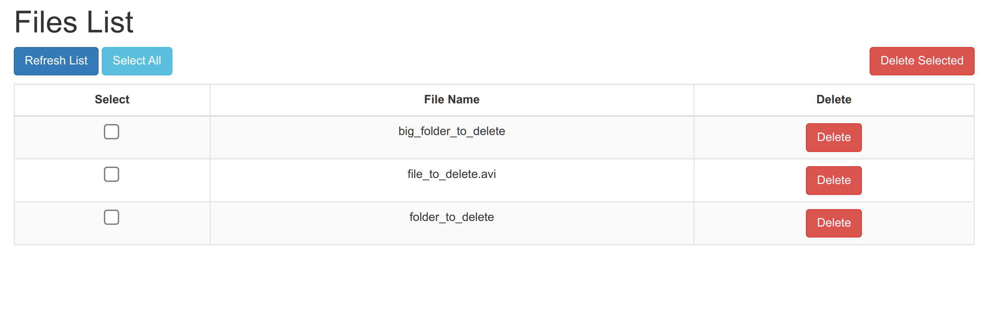

<br/>
<p align="center">
  
  <h2 align="center">Removarr</h2>
</p>
<p align="center">
  <a href="https://github.com/garnajee/removarr/issues/new?template=bug_report.md"></a> 
  <a href="https://github.com/garnajee/removarr/issues/new?template=feature_request.md">
  </a>
  <br/>
  <a href="https://github.com/garnajee/removarr/stargazers">
    
  </a>
  <a href="https://github.com/garnajee/removarr/forks">
    
  </a>
  <br/>
  
  
  
  <br/>
  
</p>

---

This is a web application, created to help you manually delete files present in the (Transmission `completed/`) downloads folder but not in the (Jellyfin) `medias/` folder. If you have separated folders it'll also works.

Removarr is a web application designed to assist the \*arr apps like Radarr and Sonarr by helping you automatically identify and manually delete duplicate files from your Transmission download folder that are already present in your Jellyfin library. 

Take a look at the screenshot of the web-app:



# Table of Content

- [removarr](#removarr)
  * [Use case example](#use-case-example)
  *  [How it works](#how-it-works)
      + [Proof it works](#proof-it-works)
  * [How to install](#how-to-install)
  * [Todo](#todo)
  * [Build](#build)
- [License](#license)

## Use case example

Imagine you've downloaded a movie through Radarr. It's stored in your torrent client download folder and automatically hardlink to your Jellyfin library.
Later, Radarr finds a better version, which also downloaded and hardlinked to Jellyfin, replacing the older one.
Howerver, both versions remain in your torrent client download folder.
So here comes Removarr. It will automatically identifies these duplicates, allowing you to delete them easily.

## How it works

A recursive comparison according to the inodes of the files is made between the `completed/` folder (on the Transmission side) and the folders where the media are stored (on the Jellyfin side).

Example 1:

```
├── completed       # Transmission side
│   ├── folder1
│   ├── ...
│   ├── files
│   └── ...
└── medias          # Jellyfin side
    ├── movies
    │   ├── folders
    │   └── ...
    └── series
        ├── folders
        └── ...
```

Example 2:

```
├── completed       # Transmission side
│   ├── folder1
│   ├── ...
│   ├── files
│   └── ...
├── movies          # Jellyfin side
│   ├── files
│   ├── folders
│   │   └── ...
│   └── ...
└── series          # Jellyfin side
    ├── files
    └── folders
        └── ...
```

All the files present on the side of Jellyfin are the latest versions that we want to keep. So, all we want to remove is everything that is present on the Transmission side but not on the Jellyfin side.

If the deleted file was in a folder: 

- if the folder is now empty, then the folder is deleted
- if the folder does not contain other files with extension '.mkv', '.mp4', '.avi', '.mov', then the folder is deleted
- if the folder does not contain subfolder(s), the folder is deleted

### Proof it works

I'm using this app on a Synology NAS.

I have 2x6TB HDD in RAID 1. The filesystem of my main volume (`/volume1`) is in `Btrfs`.

To try if the file was properley deleted and if I recovered the storage, I ran this command before and after the deletion of the file:

```bash
$ btrfs fi usage /volume1/ -g
```

I deleted a file of about **1,9 GB**. Here is the diff before and after the deletion:

```diff
Overall:
     Device allocated:                  2884.02GiB
     Device unallocated:                2693.98GiB
     Device missing:                       0.00GiB
-    Used:                              2843.89GiB
-    Free (estimated):                  2732.34GiB      (min: 1385.35GiB)
+    Used:                              2842.04GiB
+    Free (estimated):                  2734.20GiB      (min: 1387.21GiB)
     Data ratio:                              1.00
     Metadata ratio:                          2.00
     Global reserve:                       0.28GiB      (used: 0.00GiB)
 
-Data,single: Size:2880.01GiB, Used:2841.64GiB
+Data,single: Size:2880.01GiB, Used:2839.79GiB
    /dev/mapper/cachedev_0      2880.01GiB
```

## How to install

Nothing more simple than to use the [docker-compose](docker-compose.yml) file.

* First option: (like the example above) you have **one** folder for all your media, use [this file](docker-compose.yml):

```yaml
services:
  removarr:
    image: ghcr.io/garnajee/removarr:latest
    container_name: removarr
    restart: always
    environment:
      - PUID=1030
      - PGID=100
      - TR_IP=${TR_IP}
      - TR_PORT=${TR_PORT}
      - TR_USERNAME=${TR_USERNAME}
      - TR_PASSWORD=${TR_PASWWORD}
    volumes:
      - '/your/path/completed/:/data/completed'
      - '/your/path/medias/:/data/medias'
    ports:
      - '127.0.0.1:8012:5000'
```

* Second option: you have several folders not in the same place, use [this file](docker-compose-2.yml):

```yaml
services:
  removarr:
    image: ghcr.io/garnajee/removarr:latest
    container_name: removarr
    restart: always
    environment:
      - PUID=1030
      - PGID=100
      - TR_IP=${TR_IP}
      - TR_PORT=${TR_PORT}
      - TR_USERNAME=${TR_USERNAME}
      - TR_PASSWORD=${TR_PASWWORD}
    volumes:
      - '/your/path/completed/:/data/completed'
      - '/your/path/movies/:/data/movies'
      - '/your/path/series/:/data/series'
    ports:
      - '127.0.0.1:8012:5000'
```

The application will be available at `<you_ip>:8012`.

* Volumes

`/your/path/completed/`: change this by the path of your download folder

`/your/path/medias/`   : change this by the path of your Jellyfin medias folder

* Port

`8012`: change this port to suit your needs.

## Todo

- [x] add `.mov` extension
- [ ] add `user: "${PUID}:${PGID}` in docker compose files
- [ ] update README to specify how to use the .env file
- [ ] update tests/README to explain how to source .env file when not using the removarr docker (`set -/+ a`...)
- [ ] add total size of all files
- [ ] add size of each file in a column
- [ ] sort table by alphabetic order and file size
- [ ] add an "unwanted" button, hide files to avoid deleting them by mistake
- [ ] make the app more responsive

## Build

To build this application, follow these steps:

* build the Dockerfile: `$ docker build -t <your_image_name> .`
* run the image: `$ docker run -p 5000:5000 -v /your/path/completed:/data/completed -v /your/path/medias:/data/medias <your_image_name>`

If you want to use a docker-compose.yml instead of the Dockerfile, then use this example:

```diff
  removarr:
-   image: ghcr.io/garnajee/removarr:latest
    ...
  removarr:
+   build: .
    ...
```

* you can now build this docker-compose.yml: `$ docker-compose build`
* and finally, run: `$ docker-compose up -d`

# License

This project is under [MIT](LICENSE) License.

